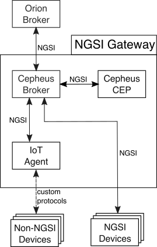

- [Introduction](#introduction)
- [Architecture](#architecture)
- [Glossary](#glossary)
- [Cepheus-CEP](cep/README.md)
- [Cepheus-Broker](broker/README.md)

# Introduction

Fiware-Cepheus provides two components to an NGSI gateway : [Cepheus-broker](broker/README.md) a lightweight NGSI broker and [Cepheus-CEP](cep/README.md) a Complex Event Processor.

These components will work together and with other NGSI compatible components
(like the [Orion broker](https://github.com/telefonicaid/fiware-orion) or [IoT Agents](https://github.com/telefonicaid/iotagent-node-lib))
to build full NGSI compliant IoT networks.

For building and running these two components, please refer to [Github's root README](http://github.com/orange-opensource/fiware-cepheus/README.md).

# Architecture

Here is the proposed (and tested) general architecture:

In this architecture, all components communicate using the NGSI Information Model, except for non-NGSI devices which are proxied by the IoT Agent.

# Glossary

### Fiware terms

- Gateway / edge:  intermediary NGSI component, optional executing fiware-cepheus components (typically a RaspberryPi deployed near the sensors).
- Sensors : NGSI capable devices that can transmit some data as Context Entities to other NGSI enabled components.

### NGSI terms

These terms are here described using more common software engineering terms.

- Context Information model : the global name of the NGSI data model
- Context Providers / Context Producers : source of Context Elements updates
- Context Managers / Broker : service that can host / forward Context Entities
- Context Entity / Element : a class (e.g. a person, place, event, thing) defining a group of attributes
- Context Attributes : attributes associated to a Context Entity
- Metadata : some metadata associated to each attributes of a Context Element
- Entity Id: the unique id of a Context Entity
- Entity Type : the type of a Context Entity

### CEP terms

These terms are related to the CEP (complex event processor) and are described using the NGSI terminology.

- Event : an update to the state of Context Entity
- Event type : the set of attributes an event can update.
- Stream : a flow of events of the same type.
- Incoming events : a stream generated by Context Providers and that are addressed to the CEP engine (seen as a Context Manager)
- Outgoing events : a stream generated by the CEP engine (seen as a Context Producer) in result of applying statements to incoming events and sent to a Context Broker.
- Statements : a set of rules that are applied by the CEP engine to incoming events and that generates outgoing events.

