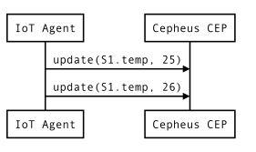
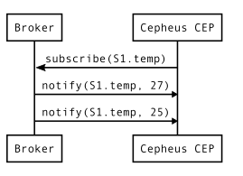
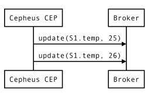

# JSON Configuration

The configuration a simple JSON object containing the complete description of the behavior of the CEP engine
(a set of EPL statements) and the mapping between the NGSI Context Entities and CEP Events.

Here is an example:

```json
{
  "host":"http://localhost:8080",
  "in":[
    {
      "id":"Room.*",
      "type":"Room",
      "isPattern": true,
      "attributes":[
        {
          "name":"temperature", "type":"double",
          "metadata": [
            { "name":"unit", "type":"string" }
          ]
        },
        { "name":"floor", "type":"string" }
      ],
      "providers":[
        { 
          "url":"http://localhost:8081",
          "serviceName": "tenant",
          "servicePath": "test/example"
        }
      ]
    }
  ],
  "out":[
    {
      "id":"FloorX",
      "type":"Floor",
      "attributes":[
        {
          "name":"temperature", "type":"double",
          "metadata": [
            { "name":"unit", "type":"string" }
          ]
        }
      ],
      "brokers":[
        {
          "url":"http://orion.fiware.org:3000",
          "serviceName": "tenant",
          "servicePath": "test/example",
          "authToken": "OAUTH_TOKEN"
        }
      ]
    }
  ],
  "statements":[
    "INSERT INTO Floor SELECT floor as id, avg(temperature) as temperature, temperature_unit FROM Room.win:time(10 min) GROUP BY floor OUTPUT LAST EVERY 10 sec"
  ]
}
```

## Main sections

### Host url

The `host` url defined the HTTP address (scheme, host and port) where the Cepheus-CEP can be contacted.
It is used to subscribe to Context Providers (see next section).

### Incomming events

The `in` array defines the list of incoming events (NGSI Context Entities updates) the CEP expects as input from Context Providers.

Each Context Entity must be defined by:

 - `id`: the ID of the Context Entity, can be a pattern if `isPattern` is `true`, mandatory.
 - `type`: the type of the Context Entity, mandatory.
 - `isPattern`: if the `id` is a pattern, optional, default: `false`.
 - `attributes`: the list of Context Attributes to match, mandatory, cannot be empty.
 - `providers` : the list of URL to Context Provider to subscribe for this Context Entity.

Each Context Attributes is defined by:

 - `name`: the name of the attribute, mandatory.
 - `type`: the type of the attribute, mandatory.
           Only simple types are supported for now : `string`, `double`, `float`, `int`, `bool`.
 - `metadata`: the list of attribute Context Metadata, optional.
 - `jsonpath`: a jsonpath to allow accessing the value inside a "complex" object, optional.

Each Context Metadata is defined by:

- `name`: the name of the metadata, mandatory.
- `type`: the type of the metadata, mandatory.
          Only simple types are supported for now : `string`, `double`, `float`, `int`, `bool`.
- `jsonpath`: a jsonpath to allow accessing the value inside a "complex" object, optional.

Each Providers is defined by:

- `url`: the URL to the provider, mandatory.
- `serviceName`: the value of the `Fiware-Service` HTTP header, optional.
- `servicePath`: the value of the `Fiware-ServicePath` HTTP header, optional.

### Outgoing events

The `out` array defines the list of the outgoing events translated to Context Entities.

Each Context Entity must be defined by:

- `id`: the ID used by default for the Context Entity if the EPL statement does not define one, mandatory.
- `type`: the type of the Context Entity, mandatory.
- `isPattern`: if the `id` is a pattern, optional, default: `false`.
- `attributes`: the list of Context Attributes to match, mandatory, cannot be empty.
- `brokers`: the list of Brokers to notify.

Each Context Attributes is defined by:

- `name`: the name of the attribute, mandatory.
- `type`: the type of the attribute, mandatory.
          Only simple types are supported for now : `string`, `double`, `float`, `int`, `bool`.
- `metadata`: the list of attribute Context Metadata, optional.

Each Context Metadata is defined by:

- `name`: the name of the metadata, mandatory.
- `type`: the type of the metadata, mandatory.
          Only simple types are supported for now : `string`, `double`, `float`, `int`, `bool`.

Each Brokers is defined by:

- `url`: the URL to the broker, mandatory.
- `serviceName`: the value of the `Fiware-Service` HTTP header (required by Orion Broker), optional.
- `servicePath`: the value of the `Fiware-ServicePath` HTTP header (required by Orion Broker), optional.
- `authToken`: the value of the `X-Auth-Token` HTTP header (required by PEP Proxy), optional.

### Statements

The `statements` array defines a list of [Esper EPL statements](http://www.espertech.com/esper/release-5.2.0/esper-reference/html/epl_clauses.html)
that will interact with the events previously defined.

## Special fields

### providers field

The `providers` field controls how the CEP expect to receive incoming events.

There is two ways Context Providers can notify the CEP:

 - The simplest way for the Context Provider is to send directly `/updateContext` requests to the CEP.



<!--```sequence
participant IoT Agent as C
participant Cepheus CEP as B

C->B: update(S1.temp, 27)
C->B: update(S1.temp, 25)
```-->

 - The second way is to make the CEP subscribe to the Context Provider (like a Broker).
   For each Context Provider the defined in the `providers` field of an event, the CEP will send initialy a `/subscribeContext`,
   and will expect in return the Context Provider to notify it with `/notifyContext` requests.



<!--```sequence
participant Broker as C
participant Cepheus CEP as B
B->C: subscribe(S1.temp)
C->B: notify(S1.temp, 27)
C->B: notify(S1.temp, 25)
```-->

### brokers field

Each outgoing event can have multiple brokers.
The CEP will send an `ngsi10/updateContext` request to each broker for every outgoing event.



<!--```sequence
participant Cepheus CEP as A
participant Remote broker as B
A->B: update(S1.temp, 25)
A->B: update(S1.tep, 26)
```-->

### jsonpath field

The `jsonpath` field of an Context Attribute or Context Metadata allows to extract
the value from a deeply nested structure using a [JsonPath](https://github.com/jayway/JsonPath) expression.

This works both for JSON and XML formats (with some limitations for the XML format).

For example, if an `/updateContext` request sends the following payload:

```
    {
        "contextElements": [
            {
                "type": "Room",
                "isPattern": "false",
                "id": "Room1",
                "attributes": [
                    {
                        "name": "temperature",
                        "type": "double",
                        "value": { "raw": ["16.2", "°C", "Celcus"] }
                    },
                    {
                        "name": "floor",
                        "type": "string",
                        "value": "1"
                    }
                ]
            }
        ],
        "updateAction": "UPDATE"
    }
```

The `16.2` value can be extracted from the JSON object `{ "raw": ["16.2", "°C", "Celcus"] }`
by using the JsonPath expression : `$.raw[0]`.

Here is an example configuration to handle this payload by exposing the temperature value to the CEP:

```
    {
        "host":"http://localhost:8080",
        "in":[
            {
                "id":"Room1",
                "type":"Room",
                "attributes":[
                    { "name":"temperature", "type":"double", "jsonpath":"$.raw[0]" },
                    { "name":"floor", "type":"string" }
                ]
            }
        ],
        "out":[
            {
                "id":"Floor1",
                "type":"Floor",
                "attributes":[
                    { "name":"temperature", "type":"double" }
                ]
            }
        ],
        "statements":[
            "INSERT INTO Floor SELECT floor as id, avg(temperature) as temperature FROM Room.win:time(10 min) GROUP BY floor OUTPUT LAST EVERY 10 sec"
        ]
    }
```


