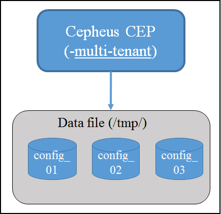
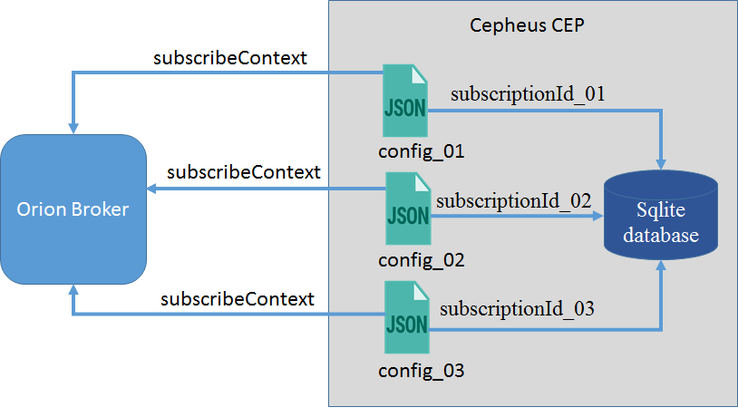
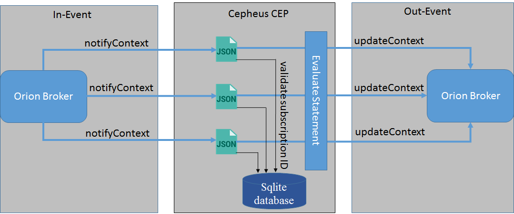

# Multi-tenancy

A tenant is a group of users who share a common access with specific privileges to the software instance. The multi-tenant is an architecture that allow a single instance of a software runs on a server and serves multiple tenants. Multi-tenant ensures that the entities/attributes/subscriptions of one tenant are "invisible" to other tenants.

Tenant is a ```service``` in FIWARE terminology.A tenant can be composed by multiple child ```subtenants```(subservices/servicePath).

The way to address tenants are HTTP headers

```
Fiware-Service : <Service_Name>
Fiware-Servicepath: <Subservice_Name>
```

Note: ```Subtenant``` must start with the ```/``` character.

Cepheus-CEP is designed to provide every tenant a dedicated share of the instance including its data, configuration, user management, tenant individual functionality and non-functional properties.

For Cepheus-CEP to work in ```multi-tenant``` way a user need to enable multi-tenanancy by uncommenting ```spring.profiles.active=multi-tenant``` in application.properties(for build from source)/cep.properties(for Debian package), this feature is disabled by default.

By enabling this, user can send different configuration for different tenant. Name of file will be obtained by ```cep-<Fiware-Service>-<Fiware-ServicePath>``` provided in request Header.

<a name="multi_01"></a>


The way multi-tenancy is defined in Cepheus-CEP is to have a ```one-to-one``` mapping between Orion and Cepheus-CEP tenants e.g., if tenant ```testservice``` exists on Orion(at servicename field in providers), then it should exist on Cepheus-CEP(at request header as Fiware-Service).

Sample Config file for Cepheus CEP:

```
POST http://localhost:8080/v1/admin/config
Fiware-Service: testservice
Fiware-ServicePath: /testservicepath

{
  "host":"http://localhost:8080",
  "in":[
      ...
      "providers":[
      	{ 
          "url":"http://localhost:1026",
          "serviceName": "testservice",
          "servicePath": "/testservicepath"
        }
      ],
      ...
   ]
  "out":[
      ...
      "brokers":[
        {
          "url":"http://localhost:1026",
          "serviceName": "test",
          "servicePath": "/"
        }
      ]
   ]
}
```

Note: ```serviceName/servicePath``` of orion and ```Fiware-Service/Fiware-ServicePath``` of Cepheus-CEP should be same for processing of events. serviceName/servicePath of the orion and Fiware-Service/Fiware-ServicePath of Cepheus-CEP are mapped at the time of subscription.

On sending this configuration, Cepheus-CEP saves the configuration as a configuration file locally named as ```cep-testservice-testservicepath```. Then it subscribe to orion for the given serviceName and servicePath(given in provider section). 

<a name="multi_02"></a>


Whenever Cepheus-CEP receive notifyContext from orion(as In-Event) for any change in value of attributes, it processes Out-Event based on the statement provided in the statements section and generates outgoing Event as an output of the processing.

<a name="multi_03"></a>


### Current Limitation
* The incompatibility between multi-tenancy of Cepheus and serviceName/servicePath defined in providers, i.e., this will not work if we use different tenant in Cepheus CEP and orion.
* The outstanding bugs when using multi tenancy with Orion, mainly #73 and #64.
* Not yet "production ready".
