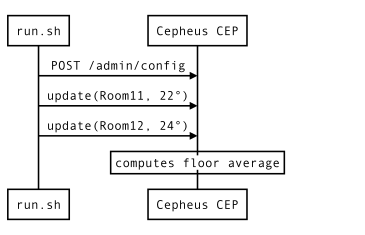
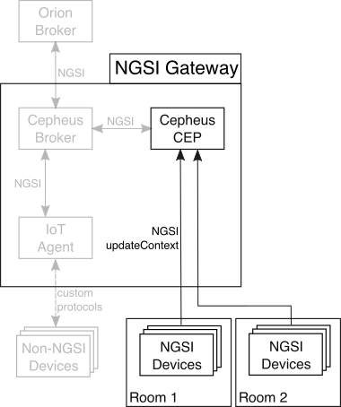

This example show a basic event processing with Cepheus-CEP.

Let us consider we have :

 - a set of NGSI-capable temperature sensors across multiple rooms
 - multiple rooms over a set of floors

We would like to get the average temperature (over the last 10 minutes) on each floor (updated every 1 minute).

## Architecture

We will start with a very simple configuration where the NGSI sensors send directly to the CEP (using `updateContext` requests)
the updated temperatures. The NGSI sensors requests are simulated by a simple script.

The components involved in this example are:

All the grayed parts are part of the reference architecture and are not used in this example.

## Setup

We must first configure our NGSI compatible sensors to output their values as the following Context Entity:

     {
         "id": "Room31", // Room 1 on floor 3 (could be anything else)
         "type":"Room",  // all sensors must use the same "Room" type
         "attributes": [
            { "name":"temperature", "type":"double", "value":"21" }, // this is the value of the sensors
            { "name":"floor", "type":"string", "value":"3" } // the room is on the third foor
         ]
     }

We can configure the CEP to accept these NGSI updates and trigger the update of
a Context Entity that would be based on the floors :

    {
        "id": "Floor1", // uniquely identifies a floor (coud be anything else)
        "type":"Floor", // all floor must use the same "Floor" type
        "attributes": [
            { "name":"temperature", "type":"double", "value":"23.3" }, // this will be the average temperature of the floor
        ]
    }

The EPL rule to average the temperature based on the previous model is :

    INSERT INTO Floor
    SELECT floor as id, avg(temperature) as temperature
    FROM Room.win:time(10 minutes)
    GROUP BY floor
    OUTPUT LAST EVERY 1 min

Please refer to Esper EPL manual for details about the syntax of this rule.
We are using the "floor" attribute of the Room as the "id" of the Floor.
The average is computed by the `avg()` method over the Room temperature and returned as temperature attribute for Floor.
We are grouping results by floor and triggering the output every minute after waiting an initial minute.

## Configuring the CEP

Translated to the configuration format of the Cepheus-CEP, we get the following "in" section for accepting Room temperature as input :

    "in": [
        {
            "id":"Room*",      # Pattern is used to subscribe to provider to all Room1, Room2, ..., RoomN
            "type":"Room",     # The type to subscribe
            "isPattern":true,  # Pattern match the id
            "providers":[ "http://localhost:8081" ],  # The URL of the source of the input
            "attributes":[
                { "name":"temperature", "type":"double" },
                { "name":"floor", "type":"string" }
            ]
        }
    ]

The "out" section is also similar to the NGSI Context Entity of a Floor:

    "out":[
        {
            "id":"Floor1",
            "type":"Floor",
            "attributes":[
                { "name":"temperature", "type":"double" }
            ]
        }
    ]

The [config.json](config.json) has the complete configuration setup.

In this configuration, the time of the output has been lowered to 10 seconds
to make the average show up quickly in the logs.

## Testing the setup

You can run the [run.sh](run.sh) file in a terminal while checking the logs of Cepheus CEP
to see the Rooms temperature sent to the CEP and the CEP reacting to the events.

In a first terminal, launch Cepheus-CEP:

    cd cepheus-cep
    mvn spring-boot:run

Default configuration should launch it on port :8080 on your machine.

Now in another terminal, trigger the [run.sh](run.sh) script:

    cd doc/examples/1_RoomsAndFloors
    sh run.sh

The script first sends the [config.json](config.json) file to Cepheus-CEP, then it starts
sending temperatures updates.

Go back to the terminal where you launched the CEP. You should see temperatures as "EventIn" being logged.

After a few seconds, the "EventOut" logs will show the CEP triggering the average temperature for each floor.

## Next step

You can go the the next example to lean more about complex event processing.
