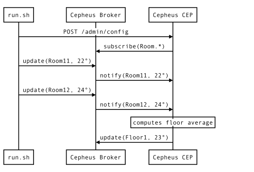
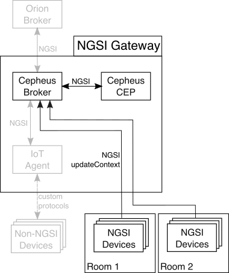

This example shows how Cepheus-CEP and Cepheus-Broker interact with each other.

It is based on the Rooms and Floors example.
But this time, temperature data will not be sent directly to the Cepheus-CEP, but will transit though the Cepheus-Broker.

## Architecture

In this example, the NGSI sensors (simulated by the run.sh script) will send temperature data to the Cepheus-Broker.
The Cepheus-CEP will subscribe to the broker for this data and therefore be notified when new data is received.



This is illustrated in the following figure:



All the grayed parts are part of the reference architecture and are not used in this example.

## Configuring the CEP

The configuration is similar to the first example, but we now add the `providers` in the `in` section.
This will tell the CEP to subscribe for the Room Context Entity to one or more Context Providers (here the Cepheus-CEP instance).

    "in": [
        {
            "id":"Room.*",     # Pattern is used to subscribe to provider to all Room1, Room2, ..., RoomN
            "type":"Room",     # The type to subscribe
            "isPattern":true,  # Pattern match the id
            "providers":[ "http://localhost:8081" ],  # The URL of the source of the input
            "attributes":[
                { "name":"temperature", "type":"double" },
                { "name":"floor", "type":"string" }
            ]
        }
    ]

The `out` section is also similar to the first example but we add a `brokers` section
to send the update for this Context Entity to the Cepheus-Broker.

    "out":[
        {
            "id":"Floor1",
            "type":"Floor",
            "attributes":[
                { "name":"temperature", "type":"double" }
            ],
            "brokers": [
                { "url":"http://localhost:8081" }
            ]
        }
    ]

The [config.json](config.json) has the complete configuration setup.

In this configuration, the time of the output has been lowered to 10 seconds
to make the average show up quickly in the logs.

## Testing the setup

In a first terminal, launch Cepheus-Broker:

    cd cepheus-lb
    mvn spring-boot:run --remote.url=""

Default configuration should launch it on port :8081 on your machine.

Then in a second terminal, launch Cepheus-CEP:

    cd cepheus-cep
    mvn spring-boot:run

Default configuration should launch it on port :8080 on your machine.

Now in another terminal, trigger the [run.sh](run.sh) script:

    cd doc/examples/3_CepAndBroker
    sh run.sh

The script first sends the [config.json](config.json) file to Cepheus-CEP.

Cepheus-CEP sends a `subscribeContext` request in order to receive notifications from the Cepheus-Broker for the Room Context Entity.

Then the script sending temperatures updates to Cepheus-lb that sends notifications to Cepheus-CEP.

Go back to the terminal where you launched first the LB then after the CEP. You should see tempertures as "EventIn" beeing logged in CEP logs.

After a few seconds, the "EventOut" logs will show the CEP triggering the average temperature for each floor.


## Sequence Diagram


```sequence
run.sh->CEP: /v1/admin/config
CEP->LB: /ngs10/subscribeContext Room*
run.sh->LB: /v1/updateContext RoomXY ...
LB->CEP: /ngsi10/notifyContext RoomXY ...
```

## Next step

You must now learn how to send the EventOut updates to a remote NGSI broker.
