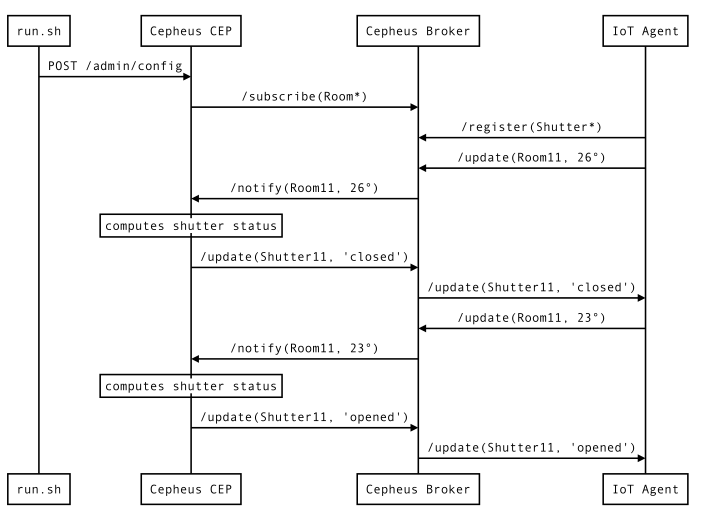
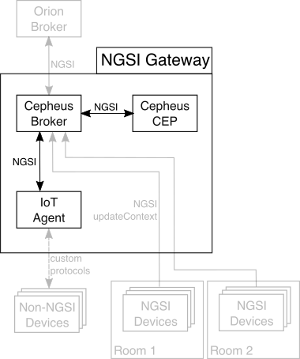

This example shows how Cepheus-CEP and Cepheus-Broker interact with IoT Agent (protocol adapter for device).

It is based on the Close Shutters example.

But this time, the close shutters command is send to IoT Agent.
In this example, we use a mock to simulate IoT Agent.

## Architecture
In this example, the NGSI sensors will send temperature data by IoT Agent to the Cepheus-Broker.
The Cepheus-CEP will subscribe to the broker for this data and therefore be notified when new data is received.
The IoT Agent will register to the broker for shutter data.
The Cepheus-CEP will send shutter status when it is triggered to Cepheus-Broker.
The Cepheus-Broker forward shutter data to the IoT Agent. 

This is illustrated in the following figure:

All the grayed parts are part of the reference architecture and are not used in this example.

## Configuring the CEP

The configuration is similar to the second example (2_CloseShutters).
This will tell the CEP to subscribe for the Room Context Entity to one or more Context Providers (here the Cepheus-Broker instance).

    "in": [
        {
            "id":"Room.*",      # Pattern is used to subscribe to provider to all Room1, Room2, ..., RoomN
            "type":"Room",     # The type to subscribe
            "isPattern":true,  # Pattern match the id
            "providers":[ "http://localhost:8081" ],  # The URL of the source of the input
            "attributes":[
                { "name":"temperature", "type":"double" },
                { "name":"floor", "type":"string" },
                { "name":"shutter", "type":"string" }  # Id of the Shutter associated to the Room
            ]
        }
    ]

The `out` section is also similar to the second example but we add a `brokers` section
to send the update for this Context Entity to the Cepheus Broker.

    "out":[
        {
            "id":"ShutterX",
            "type":"Shutter",
            "brokers":[
                    {
                      "url":"http://localhost:8081"
                    }
                  ],
            "attributes":[
                { "name":"status", "type":"string" }
            ]
        }
    ]

The [config.json](config.json) has the complete configuration setup.

## Testing the setup

You can run the [run.sh](run.sh) file in a terminal while checking the logs of Cepheus CEP
to see the Rooms temperature sent to the CEP and the CEP reacting to the events.

In a first terminal, launch mock-iotagent:

    cd doc/examples/mocks/mock-iotagent
    mvn spring-boot:run

Default configuration should launch it on port :8083 on your machine.

In a second terminal, launch Cepheus-lb without remote broker:

        cd cepheus-lb
        mvn spring-boot:run -Dremote.url=

Default configuration should launch it on port :8081 on your machine.

In a third terminal, launch Cepheus-CEP:

    cd cepheus-cep
    mvn spring-boot:run

Default configuration should launch it on port :8080 on your machine.

Now in another terminal, trigger the [run.sh](run.sh) script:

    cd doc/examples/5_CloseOpenShuttersWithTemperatureThreshold
    sh run.sh

The script first sends the [config.json](config.json) file to Cepheus-CEP.
then it starts registering to mock-iotagent for shutter Events.
Then it continues sending temperatures updates to mock-iotagent.

Go back to the terminal where you launched the CEP. You should see temperatures as "EventIn" beeing logged coming from Cepheus-lb.

After a few seconds, the "EventOut" logs will show the CEP triggering the status for each shutter.
Theses "EventOut" will send to mock-iotagent by Cepheus-lb.

We can see in mock-iotagent logs the open commands or close commands received for shutters.

## Next step

You must now learn how to send query on Context Entities from Orion to a NGSI device like IoT Agent.
