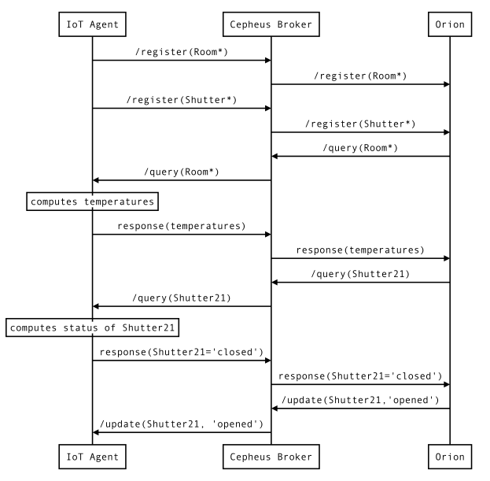
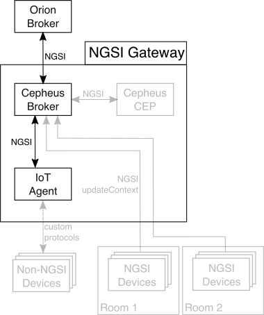

This example shows how Cepheus-Broker forwards query and command from Orion to IoT Agent (protocol adapter for device).

Lets consider we have :
 - a set of temperature sensors accross multiple rooms
 - a set of flap sensors which control opening and closing windows shutters
 - multiple rooms over a set of Floors

We would like to query the temperature of a particular room or all rooms
We would like to query the status of a particular window shutter
We would like to update the opening or closing to window shutter

In this example, we use mocks to simulate IoT Agent and Orion.

## Architecture
In this example, Orion sends a Query request to the IoT Agent through the Cepheus-Broker to know the current temperature of any room.
The IoT Agent sends back all temperatures through the Cepheus-Broker.
Orion sends a Query request to the IoT Agent through the Cepheus-Broker to know the current status of a shutter.
The IoT Agent sends back the status always through the Cepheus-Broker.
Orion sends a closing command shutter to the IoT Agent through the Cepheus-Broker.
The IoT Agent returns the return code of the command.

This is illustrated in the following figure:

All the grayed parts are part of the reference architecture and are not used in this example.

## Configuring the CEP
In this example, the Cepheus-CEP is not used.

## Testing the setup

In a first terminal, launch mock-orion (default on port :8082 on your machine)

    cd doc/examples/mocks/mock-orion
    mvn spring-boot:run

In a second terminal, launch Cepheus-lb:

    cd cepheus-lb
    mvn spring-boot:run

Default configuration should launch it on port :8081 on your machine.

Then in a third terminal, launch mock-iotagent:

    cd doc/examples/mocks/mock-iotagent
    mvn spring-boot:run

Default configuration should launch it on port :8083 on your machine.

Now in another terminal, trigger the [run.sh](run.sh) script:

    cd scripts/6_QueryAndCommandOnRoomAndShutter
    sh run.sh

The script manage the mocks by Admin api to send register and query.

The mock-iotagent sends the register requests for Room and Shutter Context Entities to the Cepheus-Broker. 
The Cepheus-Broker forwards the register to mock-orion.
The mock-orion requests the temperature of all rooms to the Cepheus-Broker. 
The Cepheus-Broker forwards the query request to mock-iotagent.
The mock-iotagent sends query response to the Cepheus-Broker. 
The Cepheus-Broker forwards the response to the mock-orion which prints the values.

The same for shutter status.

The mock-orion sends the update request of the status of shutter for Shutter21 to the Cepheus-Broker. 
The Cepheus-Broker forwards the update request to the mock-iotagent.
The mock-iotagent responds ok to the Cepheus-Broker. 
The Cepheus-Broker forwards the response to the mock-orion which print the response.

We can see response of the mock-iotagent in the logs of the mock-orion.
 