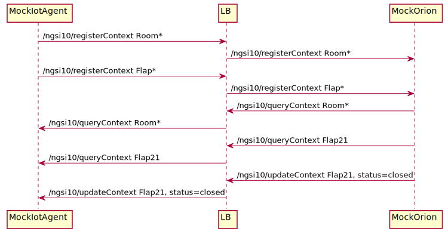

# Rooms Flaps Commands example

Lets consider we have :
 - a set of temperature sensors accross multiple rooms
 - a set of flap sensors which control opening and closing windows shutters
 - multiple rooms over a set of Floors

We would like to query the temperature of a particular room or all rooms
We would like to query the status of a particular window shutter
We would like to update the opening or closing to window shutter

## Setup
No setup.

## Testing the setup

You can run the [run.sh](run.sh) file in a terminal while checking the logs of Cepheus CEP
to see the Rooms temperature sent to the CEP and the CEP reacting to the events.

In a first terminal, launch mock-orion (default on port :8082 on your machine)

    cd doc/examples/mocks/mock-orion
    mvn spring-boot:run

In a second terminal, launch Cepheus-lb:

    cd cepheus-lb
    mvn spring-boot:run

Default configuration should launch it on port :8081 on your machine.

Then in a third terminal, launch mock-iotagent:

    cd doc/examples/mocks/mock-iotagent
    mvn spring-boot:run

Default configuration should launch it on port :8083 on your machine.

Now in another terminal, trigger the [run.sh](run.sh) script:

    cd scripts/RoomFlapQueryAndCommandWithLocalAndRemoteBrokerExample
    sh run.sh

The mock-iotagent send the register requests for Room and Flap entities to cepheus-broker. Cepheus-broker forward the register to mock-orion.
The mock-orion request the temperature of all rooms to cepheus-broker. Cepheus-broker forward the query request to mock-iotagent.
The mock-iotagent send query response to Cepheus-broker. Cepheus-broker forward the response to mock-orion which print the values.

The same for flap status.

The mock-orion send the update of the status of flap for flap21 to cepheus-broker. Cepheus-broker forward the update request to mock-iotagent.
The mock-iotagent respond ok to Cepheus-broker. Cepheus-broker forward the response to mock-orion which print the response.

## Sequence Diagram



```sequence
Mock IotAgent->LB: /ngsi10/registerContext Room*
LB->Mock Orion: /ngsi10/registerContext Room*
Mock IotAgent->LB: /ngsi10/registerContext Flap*
LB->Mock Orion: /ngsi10/registerContext Flap*
Mock Orion->LB: /ngsi10/queryContext Room*
LB->Mock IotAgent: /ngsi10/queryContext Room*
Mock Orion->LB: /ngsi10/queryContext Flap21
LB->Mock IotAgent: /ngsi10/queryContext Flap21
Mock Orion->LB: /ngsi10/updateContext Flap21, status=closed
LB->Mock IotAgent: /ngsi10/updateContext Flap21, status=closed
```
